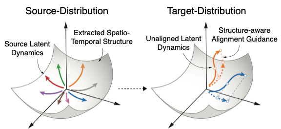
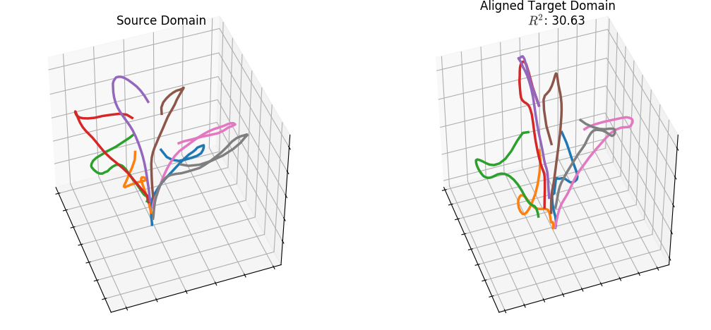

<h2>Extraction and recovery of spatio-temporal structure in latent dynamics alignment with diffusion model [NeurIPS'2023 Spotlight]</h2>

<div align='center' ><font size='4'>Yule Wang, Zijing Wu, Chengrui Li, and Anqi Wu</font></div>

<div align='center' ><font size='5'>Georgia Institute of Technology</font></div>

<div align='center' ><font size='5'>Atlanta, GA, USA</font></div>

 <br/>  

 <br/>

<div align=center></div>

## **Environment Setup**

To install the required dependancies using conda, run:

```markdown
$ conda create --name erdiff --file requirements.txt
```

To install the required dependancies using Python virtual environment, run:
```markdown
$ python3 -m venv erdiff
$ source erdiff/bin/activate
$ python3 -m pip install --upgrade pip
$ python3 -m pip install -e .
```

 

## **Training & Alignment**


### 1. **Source Domain: Training**

```markdown
$ python3 VAE_Diffusion_CoTrain.py
```


### 2. Target Domain: Maximum Likelihood Alignment

```markdown
$ python3 MLA.py
```

### 

## **Latent Dynamics Visualization**

###  


## **Cited as**

[openreview]([https://arxiv.org/abs/2306.06138](https://openreview.net/forum?id=AuXd54odxm&referrer=%5BAuthor%20Console%5D(%2Fgroup%3Fid%3DNeurIPS.cc%2F2023%2FConference%2FAuthors%23your-submissions)))

```markdown
@article{wang2024extraction,
  title={Extraction and recovery of spatio-temporal structure in latent dynamics alignment with diffusion model},
  author={Wang, Yule and Wu, Zijing and Li, Chengrui and Wu, Anqi},
  journal={Advances in Neural Information Processing Systems},
  volume={36},
  year={2024}
}
}
```

### 

###  

ERDiff poster for NeurIPS 2023.
