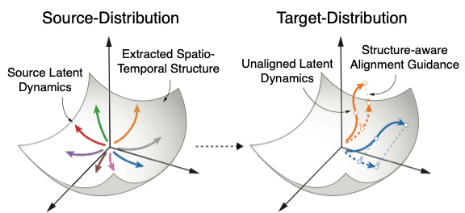
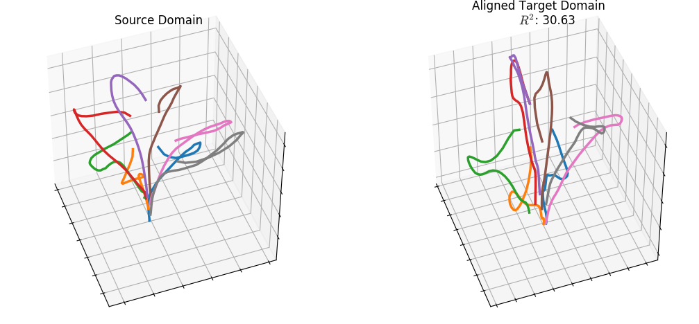

<h2>Extraction and Recovery of Spatio-Temporal Structure in Latent Dynamics Alignment with Diffusion Models [NeurIPS'2023 Spotlight]</h2>

<div align='center' ><font size='4'>Yule Wang, Zijing Wu, Chengrui Li, and Anqi Wu</font></div>

<div align='center' ><font size='5'>Georgia Institute of Technology</font></div>

<div align='center' ><font size='5'>Atlanta, GA, USA</font></div>

&nbsp;&nbsp;&nbsp;&nbsp;&nbsp;&nbsp;&nbsp;&nbsp;&nbsp;&nbsp;&nbsp;&nbsp;&nbsp;&nbsp;&nbsp;&nbsp;&nbsp;&nbsp;&nbsp;&nbsp;&nbsp;&nbsp;&nbsp;&nbsp;&nbsp;&nbsp;&nbsp;&nbsp;&nbsp;&nbsp;&nbsp;&nbsp;&nbsp;&nbsp;&nbsp;&nbsp;&nbsp;&nbsp;&nbsp;&nbsp; &nbsp;&nbsp;&nbsp;&nbsp;&nbsp;&nbsp;&nbsp;&nbsp;&nbsp;&nbsp;&nbsp;&nbsp;&nbsp;&nbsp;&nbsp;&nbsp;                 


<div align=center></div>


## Sep 14, 2026 Update

We report results from the ERDiff **v2.0.0** implementation on two public datasets: **CO-M** (center-out reaching, Monkey M) and **RT-M** (random-target reaching, Monkey M).

Datasets used here are available at Dryad: [https://datadryad.org/dataset/doi:10.5061/dryad.cvdncjt7n](https://datadryad.org/dataset/doi:10.5061/dryad.cvdncjt7n).

Values are velocity decoding **R² scores (%)**, reported as **mean ± standard deviation over five runs**.

**CO-M**

| Target session | ERDiff R² (%) |
| :---: | :---: |
| Day 8 | 34.32 ± 4.58 |
| Day 14 | 44.67 ± 3.79 |
| Day 15 | 8.02 ± 3.40 |
| Day 22 | 14.67 ± 9.88 |
| Day 24 | 17.62 ± 5.41 |
| Day 25 | 9.59 ± 4.77 |
| Day 28 | 8.38 ± 12.97 |
| Day 29 | 11.01 ± 1.56 |
| Day 31 | 34.42 ± 2.99 |
| Day 32 | 31.24 ± 2.89 |

**RT-M**

| Target session | ERDiff R² (%) |
| :---: | :---: |
| Day 1 | 71.55 ± 0.44 |
| Day 38 | 55.75 ± 1.15 |
| Day 39 | 42.50 ± 0.56 |
| Day 40 | 53.43 ± 0.36 |
| Day 52 | 49.79 ± 0.86 |
| Day 53 | 53.33 ± 0.78 |
| Day 67 | 53.49 ± 0.57 |
| Day 69 | 48.48 ± 11.08 |
| Day 77 | 25.18 ± 1.71 |
| Day 79 | 9.03 ± 2.59 |

## May 9, 2026 Update

A new tag **v2.0.0** has been created.

### Changes:
- This update makes the overall diffusion alignment process robust.


## March 8, 2025 Update  

A new tag **v1.0.1** has been created.

### Changes:
- Initialized linear probing layers with an identity matrix to enhance alignment stability.  
- Improved diffusion model stability using data augmentation and `cosine_beta_schedule`.  
- Resolved NaN issues for better numerical stability.  


## **Environment Setup**

To install the required dependancies using conda, run:

```bash
conda create --name erdiff --file requirements.txt
```

To install the required dependancies using Python virtual environment, run:
```bash
python3 -m venv erdiff
source erdiff/bin/activate
python3 -m pip install --upgrade pip
python3 -m pip install -e .
```

To train the diffusion model on the source session, run:
```bash
cd scripts/ && sbatch run_diffusion_train.sh
```

To perform the diffusion-guided maximum likelihood alignment, run:
```bash
cd scripts/ && sbatch run_mla.sh
```

The alignment process across epochs can be viewed in `scripts/mla_erdiff_398637.out`.

## **Neural Latent Trajectories and their Dynamics Visualization**

###  


## **Cited as**
If you find the code useful for your research, please consider citing our work:

```markdown
@article{wang2024extraction,
  title={Extraction and recovery of spatio-temporal structure in latent dynamics alignment with diffusion model},
  author={Wang, Yule and Wu, Zijing and Li, Chengrui and Wu, Anqi},
  journal={Advances in Neural Information Processing Systems},
  volume={36},
  year={2024}
}
```

## **Poster for NeurIPS 2023**

###  

